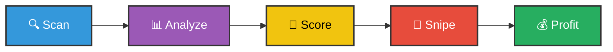

<p align="center">
  
</p>

<p align="center">
  
  
  
  
</p>

<p align="center">
  <b>🎯 Automatically discover, analyze, and register high-value expiring domains before they're taken</b>
</p>

<p align="center">
  <a href="#-quick-start">Quick Start</a> •
  <a href="#-features">Features</a> •
  <a href="#-how-it-works">How It Works</a> •
  <a href="#-profit-model">Profit Model</a> •
  <a href="#-usage">Usage</a> •
  <a href="#-configuration">Configuration</a>
</p>

---

## 💰 The Opportunity

<table>
<tr>
<td width="50%">

### Register for **$10**
</td>
<td width="50%">

### Flip for **$2,000 - $10,000+**
</td>
</tr>
<tr>
<td>

</td>
<td>

</td>
</tr>
</table>

Every day, thousands of valuable domain names expire because owners forget to renew. These domains have:
- 📈 **High Domain Authority** (SEO value built over years)
- 🔗 **Quality Backlinks** (worth thousands in link building)
- 🏷️ **Brandable Names** (perfect for startups and agencies)
- 🕐 **Aged History** (trust signals for search engines)

---

## ✨ Features

<table>
<tr>
<td width="33%" align="center">
<br/>
<b>🔍 Domain Scanner</b><br/>
<sub>Fetches pending delete lists from multiple registrar sources with intelligent filtering</sub>
</td>
<td width="33%" align="center">
<br/>
<b>🧠 AI-Powered Analysis</b><br/>
<sub>Claude LLM scores brandability, memorability, and industry fit</sub>
</td>
<td width="33%" align="center">
<br/>
<b>🎯 Auto-Registration</b><br/>
<sub>Fires rapid registration requests with retry logic</sub>
</td>
</tr>
</table>

### Core Capabilities

| Feature | Description |
|---------|-------------|
| 📊 **SEO Metrics** | Domain Authority, Domain Rating, backlink count, referring domains |
| 🏆 **Quality Scoring** | Composite score (0-100) combining SEO, brandability, age, and TLD |
| 🤖 **AI Brandability** | LLM analyzes memorability, pronounceability, and industry fit |
| 💎 **Gem Detection** | Automatically identifies high-value opportunities |
| 💵 **Value Estimation** | Predicts resale value based on comprehensive analysis |
| 🛡️ **Spam Filtering** | Filters out low-quality and spam domains |
| 📈 **ROI Calculator** | Shows potential profit margins before registration |
| 🔄 **Multi-Registrar** | Supports GoDaddy, Namecheap, and more |

---

## 🚀 Quick Start

```bash
# Clone the repository
git clone https://github.com/yourusername/domainsnipe.git
cd domainsnipe

# Create and activate virtual environment
python -m venv venv
source venv/bin/activate  # Windows: venv\Scripts\activate

# Install the package
pip install -e .

# Configure your API keys
cp .env.example .env
# Edit .env with your credentials

# Start scanning!
domainsnipe scan --count 50
```

---

## 🔧 How It Works



### 1️⃣ **Scan Phase**
- Fetches pending delete lists from multiple sources
- Filters by TLD, length, age, and spam patterns
- Removes duplicates and low-quality domains

### 2️⃣ **Analysis Phase**
- **SEO Metrics**: Checks Domain Authority, backlink quality
- **Brandability**: AI scores memorability and pronounceability
- **Value Estimation**: Calculates potential resale value

### 3️⃣ **Scoring Phase**
```
Total Score = (SEO × 0.4) + (Brandability × 0.3) + (Age × 0.2) + (TLD × 0.1)
```

### 4️⃣ **Snipe Phase**
- Verifies availability across registrars
- Fires rapid registration requests
- Retries with exponential backoff

---

## 📖 Usage

### 🔍 Scan for Expiring Domains

```bash
domainsnipe scan --count 50
```

<details>
<summary>📸 <b>View Sample Output</b></summary>

```
┌─────────────────────────────────────────────────────────────┐
│                  Top 20 Expiring Domains                    │
├────────────────────┬───────┬────┬───────┬──────────┬───────┤
│ Domain             │ Score │ DA │ Brand │ Est. Val │  Gem  │
├────────────────────┼───────┼────┼───────┼──────────┼───────┤
│ fastcar.com        │  78.5 │ 52 │   8.5 │  $4,200  │   ★   │
│ cloudtech.io       │  71.2 │ 45 │   7.8 │  $3,100  │   ★   │
│ swiftpay.co        │  68.9 │ 41 │   8.2 │  $2,800  │   ★   │
└────────────────────┴───────┴────┴───────┴──────────┴───────┘
```
</details>

### 💎 Find Gem Domains

```bash
domainsnipe gems --count 100
```

### 🔬 Analyze Specific Domain

```bash
domainsnipe analyze fastcar.com
```

<details>
<summary>📸 <b>View Sample Analysis</b></summary>

```
Analysis for fastcar.com

Total Score: 78.50/100
Is Gem: YES ✓

SEO Metrics:
  Domain Authority: 52
  Domain Rating: 48
  Referring Domains: 1,350
  Backlink Count: 18,900
  Backlink Quality: HIGH
  SEO Score: 68.50/100

Brandability:
  Overall Score: 8.5/10
  Length Score: 9.0/10
  Memorability: 8.8/10
  Pronounceability: 9.2/10
  Industry Fit: Automotive, Transportation, Racing
  Analysis: Short, memorable, easy to spell and pronounce

Value Assessment:
  Estimated Value: $4,200.00
  Registration Cost: $10.98
  Potential ROI: 382x
```
</details>

### 🎯 Auto-Snipe Mode

```bash
# Dry run (recommended first)
domainsnipe autosnipe --dry-run --count 100

# Live registration (use with caution!)
domainsnipe autosnipe --count 100
```

### 📊 Generate Reports

```bash
domainsnipe report
```

### ⚙️ View Configuration

```bash
domainsnipe config-info
```

---

## ⚙️ Configuration

### Environment Variables

Create a `.env` file from the template:

```bash
cp .env.example .env
```

<details>
<summary>📝 <b>View All Configuration Options</b></summary>

```bash
# ═══════════════════════════════════════════════════════════════
# SEO ANALYSIS APIs (Optional - falls back to simulation)
# ═══════════════════════════════════════════════════════════════
MOZ_ACCESS_ID=your_moz_access_id
MOZ_SECRET_KEY=your_moz_secret_key
AHREFS_API_KEY=your_ahrefs_api_key

# ═══════════════════════════════════════════════════════════════
# AI BRANDABILITY ANALYSIS (Optional - uses heuristics if not set)
# ═══════════════════════════════════════════════════════════════
ANTHROPIC_API_KEY=your_anthropic_api_key

# ═══════════════════════════════════════════════════════════════
# DOMAIN REGISTRAR APIs (Required for actual registration)
# ═══════════════════════════════════════════════════════════════
GODADDY_API_KEY=your_godaddy_api_key
GODADDY_API_SECRET=your_godaddy_api_secret

NAMECHEAP_API_USER=your_namecheap_api_user
NAMECHEAP_API_KEY=your_namecheap_api_key
NAMECHEAP_USERNAME=your_namecheap_username
```
</details>

### Scoring Thresholds

| Score Range | Estimated Value | Classification |
|-------------|-----------------|----------------|
| **80-100** | $5,000 - $10,000+ | 💎 Premium Gem |
| **60-79** | $1,000 - $5,000 | ⭐ High Value |
| **40-59** | $200 - $1,000 | 📈 Moderate Value |
| **0-39** | Under $200 | 📉 Low Value |

### Gem Detection Criteria

A domain is marked as a **💎 GEM** if:
- ✅ Total score ≥ 60, OR
- ✅ Domain Authority ≥ 40 AND Brandability ≥ 7, OR
- ✅ Age ≥ 10 years AND Domain Authority ≥ 30

---

## 🛡️ Safety Features

<table>
<tr>
<td align="center">🚫<br/><b>Auto-Register OFF</b><br/><sub>Disabled by default</sub></td>
<td align="center">📊<br/><b>Daily Limits</b><br/><sub>Configurable cap</sub></td>
<td align="center">💵<br/><b>Cost Threshold</b><br/><sub>Max spend per domain</sub></td>
<td align="center">📈<br/><b>ROI Check</b><br/><sub>Min profit margin</sub></td>
</tr>
<tr>
<td align="center">🛡️<br/><b>Spam Filter</b><br/><sub>Auto-detection</sub></td>
<td align="center">🧪<br/><b>Dry Run Mode</b><br/><sub>Test without buying</sub></td>
<td align="center">📝<br/><b>Audit Logs</b><br/><sub>Full history</sub></td>
<td align="center">⚠️<br/><b>Confirmations</b><br/><sub>Double-check prompts</sub></td>
</tr>
</table>

---

## 🏗️ Project Structure

```
domainsnipe/
├── 📁 src/domainsnipe/
│   ├── 📄 __init__.py          # Package initialization
│   ├── 🖥️ cli.py               # Rich CLI interface
│   ├── ⚙️ config.py            # Configuration management
│   ├── 📊 models.py            # Pydantic data models
│   ├── 🔍 scanner.py           # Domain scanning engine
│   ├── 🧠 analyzer.py          # AI-powered analysis
│   ├── 🎯 sniper.py            # Registration automation
│   └── 🎭 orchestrator.py      # Pipeline coordinator
├── 📝 .env.example             # Environment template
├── 🚫 .gitignore               # Git ignore rules
├── 📦 pyproject.toml           # Project configuration
├── 📋 requirements.txt         # Dependencies
└── 📖 README.md                # You are here!
```

---

## 🛠️ Tech Stack

<p align="center">
  
  
  
  
  
  
</p>

---

## 🤝 Contributing

Contributions are welcome! Feel free to:

- 🐛 Report bugs
- 💡 Suggest features
- 🔧 Submit pull requests
- 📖 Improve documentation

---

## ⚠️ Disclaimer

<table>
<tr>
<td>
<b>⚠️ IMPORTANT</b><br/><br/>
This tool is for <b>educational and research purposes</b>. Domain investing carries financial risk. Always:
<ul>
<li>✅ Verify domain availability independently</li>
<li>✅ Validate value estimates with multiple sources</li>
<li>✅ Start with dry-run mode</li>
<li>✅ Set conservative budget limits</li>
<li>❌ Don't invest more than you can afford to lose</li>
</ul>
The bot uses <b>simulated data</b> when real APIs are not configured.
</td>
</tr>
</table>

---

## 📜 License

<p align="center">
  
</p>

<p align="center">
  This project is licensed under the MIT License - see the LICENSE file for details.
</p>

---

<p align="center">
  
</p>

<p align="center">
  <b>Made with ❤️ for domain investors and SEO enthusiasts</b>
</p>

<p align="center">
  <a href="#domainsnipe---expiring-domain-sniper-bot">⬆️ Back to Top</a>
</p>
